# bomblab 报告

姓名：xxx

学号：2023202128

| 总分 | phase_1 | phase_2 | phase_3 | phase_4 | phase_5 | phase_6 | secret_phase |
| --------- | ------------- | ------------- | ------------- | ----------------- |-----------|-----------|-----------|
| 7       | 1            | 1            | 1            | 1 |1  |1  |1  |


scoreboard 截图：

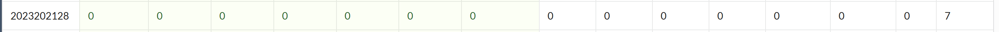


## 解题报告

### phase_1：字符串匹配

```markdown
Truth or false, it's the logic that dictates all. Rising edge ticks the clock, stimulates your flip-flop.
```

本题相对较简单，是一个简单的字符串匹配问题。

以下是本题主函数的伪代码还原：

```c++
void phase_1(string *rdi) {                // rdi存放输入的第一行的字符串指针
    string *rsi = 某个地址，定义在别处;       
    bool eax = string_not_equal(rdi, rsi); // 函数首先对比长度，如果长度相等逐个字符比对，全部相同则返回1，其他均返回0
    if (eax) explode_bomb();
    else return;
}
```

由以上代码还原不难看出，要想拆除这个phase，只需输入的字符串和rsi指向的字符串相同即可。

在gdb中，使用单步调试执行到读取rsi地址的位置，执行后通过命令` (gdb) x/s $rsi`，查看对应的内存区域存储的字符串得到如下结果。

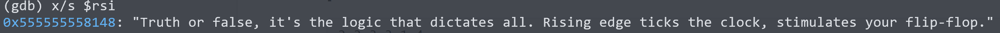

因此输入的答案只要和这一行相同即可。输入答案，问题顺利解决。


### phase_2：数组与数字计数

```markdown
2 2 3 3 1 4
```

本题是对一个连续长内存空间中的各个数字进行计数的算法，相对也比较简单。

以下是本题的伪代码翻译：

```c++
void phase_2(string* rdi) {
    int count[6] = {0};
    int arr[] = {0x46, 0x44, 0x42, 0x42, 0x44, 0x43, 0x44, 0x46, 0x43, 0x46, 0x41, 0x43, 0x41, 0x46, 0x45};
    int *input = read_six_number(rdi);     // 阅读源码后发现其利用sscanf(rdi, "%d %d %d %d %d %d",*)实现
    if (*count < 0) explode_bomb();
    for (int i = 0; i < 15; ++i)
        count[arr[i] - 0x41]++;
    for (int i = 0; i < 6; ++i)
        if (count[i] != *(input+i))
            explode_bomb();
}
```

本题较为困难的点是利用小端存储的特点还原出存储着大数rdx、rax的部分在内存中的实际分布情况，实际上他将等价于代码中所写的arr数组，只不过里面所有的int都将由一个byte存储。

接下来只要计数即可，对于arr中的所有数字，减去0x41后的数组即为它在count的索引位置，对应位置自增即可。保证输入串包含六个用空格隔开即可，肉眼计数得到从0x41~0x46的数量分别是2，2，3，3，1，4，输入答案，问题顺利解决。


### phase_3：跳转表

```markdown
2 G 83
```

本题答案理应不唯一，是一个利用跳转表实现的多重分支，只要先后匹配即可。

以下是本题的伪代码翻译：

```c++
void phase_3(string* rdi) {
    int a, c;
    char b;
    int count = sscanf(rdi, "%d %c %d", &a, &b, &c);  // 可通过gdb查看rsi指向的字符串得到参数二
    if (count <= 2 || a > 7) explode_bomb();
    char mask = 0x20;
    b ^= mask;
    switch (a) {
        case 0:
            int d = 0x61;
            if (c != 0x162) explode_bomb();
            break;
        case 1:
            int d = 0x69;
            if (c != 0x111) explode_bomb();
            break;
        case 2:
            int d = 0x67;
            if (c != 0x53) explode_bomb();
            break;
        case 3:
            int d = 0x64;
            if (c != 0x70) explode_bomb();
            break;
        case 4:
            int d = 0x61;
            if (c != 0xe5) explode_bomb();
            break;
        case 5:
            int d = 0x6e;
            if (c != 0x113) explode_bomb();
            break;
        case 6:
            int d = 0x6a;
            if (c != 0x288) explode_bomb();
            break;
        case 7:
            int d = 0x79;
            if (c != 0x3a4) explode_bomb();
            break;
    }
    if (d != b) expode_bomb();
}
```

其中较为困难的是跳转表的翻译。在` lea 0x2af4(%rip), %rdx `这条指令后，可以通过` (gdb) x/16x $rdx`查看其中的内容如下图。很明这是一个包含八个元素的数组。通过代入发现这八个数组经过代码中的变换后会成为后续的指令地址，根据这个地址就可以得到后续要进行的指令，这也就是起到了跳转表的作用，翻译成C风格代码就是switch语句。

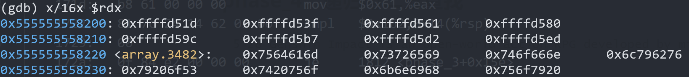

从中随机挑选一个分支，比如取a = 2，则得到c = 83， b ^ 0x20 = 0x67，计算得到结果，即2 G 83，其中与0x20取异或有类似大小写转化的作用。

输入答案，问题得到解决。


### phase_4：递归与二分查找

```markdown
5 28 Genshin Impact is an open-world action RPG developed by miHoYo
```

本题的输入用于当前phase的只有前两个数字，后续的字符串用于secret_phase的进入，后续会详细讲述。

本题通过一个函数的反复调用，事实上实现了一个简单的二分查找，其代码翻译如下：

```c++
int func4(int target, int left, int right) {
    int mid = (left + right) / 2;
    if (mid > target) mid += func4(target, left, mid - 1);
    if (mid < target) mid += func4(target, mid + 1, right);
    return mid;
}

void phase_4(string* rdi) {
    int a, b;
    int count = sscanf(rdi, "%d %d", &a, &b);    // 可通过gdb查看rsi指向的字符串得到参数二
    if (count != 2 || a > 0xe) explode_bomb();
    b -= 0xd;
    if (func(a, 0, 0xe) != 0xf || b != f) explode_bomb();
}
```

可以看到func4的作用是在连续整数 left ~ right 之间寻找整数target并返回寻找路径经过的所有数字之和，要求这个和等于15，并且输入的第二个数字减去13等于15。由于调用时left和right分别为0和14，简单模拟即可得到答案为5 28，问题得到解决。


### phase_5：字符加密

```markdown
ngdeih
```

本题通过一个数组存储了下标数字所对应的字母，并通过一些运算实现了输入串转输出串的加密工程。

以下是本题的代码翻译：

```c++
void phase_5(string *rdi) {
    int len = string_length(rdi); // 阅读源码可知，此函数返回输入串的长度
    if (len != 6) explode_bomb();
    char *arr = 某字符数组指针;
    char key[7];
	for (int i = 0; i < 6; ++i) {
        char c = *(rdi + count);
        c = (c + 15) % 16;
        c = *(arr + c);
        key[count] = c;
    }
    key[6] = '\0';
    string* rsi = 某字符串指针，可以通过内存访问;
    if (string_not_equal(key, rsi)) explode_bomb();
}
```

通过` (gdb) x/2c $rcx`获取arr内的字符元素，通过` (gdb) x/s $rsi`可以查询 rsi 指向的字符串情况，如下两幅图：

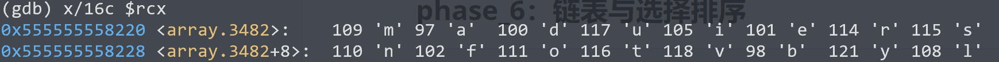

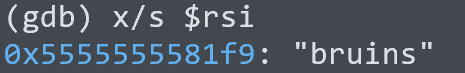

因此我们输入的六个字符经过for循环的加密后会得到bruins这个串。而for循环实现的效果用自然语言表达就是将字符c的ascii码值x变为arr[(x-1)%16]，考虑到a的ASCII码值为65刚好对应arr[0]，因此对于特定区间对应法则如下表。

| index | 0    | 1    | 2    | 3    | 4    | 5    | 6    | 7    | 8    | 9    | 10   | 11   | 12   | 13   | 14   | 15   |
| ----- | ---- | ---- | ---- | ---- | ---- | ---- | ---- | ---- | ---- | ---- | ---- | ---- | ---- | ---- | ---- | ---- |
| c     | a    | b    | c    | d    | e    | f    | g    | h    | i    | j    | k    | l    | m    | n    | o    | p    |
| arr   | m    | a    | d    | u    | i    | e    | r    | s    | n    | f    | o    | t    | v    | b    | y    | l    |

根据这个规则得到一个答案“ngdeih”，输入这个串，成功通过。


### phase_6：链表与选择排序

``` markdown
5 6 2 4 1 3
```

本题相对较复杂，可以将源码拆成两个部分阅读。

第一个部分主要实现了初步判断，保证输入的为6个大于0小于7的数字且各自不等，即输入一个0~6的排列。随后将输入的六个数字的每一个数字x变成7-x。

第二部分实现一个核心判断，即对于链表进行重新排序，排序的依据即是用处理后的输入数字作为顺序索引，并检查重新排序后的是否满足降序的需求。

本题的代码翻译如下：

``` c++
void phase_6(string *rdi) {
    // 以下为第一部分的实现
    int input[6] = read_six_number(rdi);     // 阅读源码后发现其利用sscanf(rdi, "%d %d %d %d %d %d",*)实现
	for (int i = 0; i < 6; ++i) {
        if (input[i] > 6) explode_bomb(); // 保证小于等于6
        for (int j = i; j < 6; ++j) {
            int a = input[j];
            if (a == input[i]) explode_bomb(); // 保证不重复
        }
    }
    for (int r12 = 0; r12 < 6; r12++) input[r12] = 7 - input[r12]; // 每一个数字 x 都变成 7 - x
    
    // 以下为第二部分的实现
    Node* nodeArr[6];
    Node* head = 链表首元结点指针，可以通过内存访问;
    for (int esi = 0; esi < 6; esi++)
        int ecx = input[esi], eax = 1;
        Node* edx = head;
        while (eax < ecx) {        // 顺序查找
            edx = edx -> next;
            eax++;
        }
        nodeArr[esi] = edx;
    }
	for (int i = 0; i < 5; ++i) {
        Node* ebx = nodeArr[i], eax = nodeArr[i+1];
        ebx->next = eax;           // 调整指针
    }
	nodeArr[5]->next = nullptr;
	head = nodeArr[0];
	Node* ebx = head;
	for (int ebp = 5; ebp > 0; ebp--) {
        Node* eax = ebx->next;
        if (ebx->data >= eax->data) ebx = ebx->next;
        else explode_bomb();  // 保证降序
    }
}
```

通过` (gdb) x/20x $rdx`即可查看原始链表的状态，如下图：

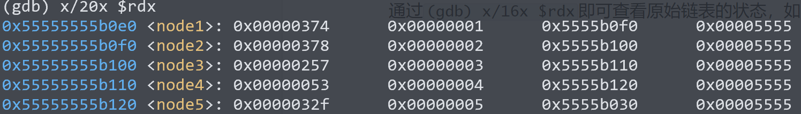

注意到还有一个结点在地址0x55555555b030位置，通过` (gdb) x/4x 0x55555555b030`即可访问最后一个结点，如下图：

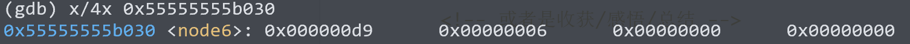

可以看到六个结点的值按照从大到小的顺序依次是node2->node1->node5->node3->node6->node4，因此输入串应为5 6 2 4 1 3，即对于每一个nodex，都转化为7 - x。

输入这一串数字，问题的到解决。


### secret_phase：递归与二维数组迷阵

``` markdown
0020000221102211231311003330000221220202
```

首先，如何进入secret_phase？观察反汇编得到的代码文件，除了常规的phase1~6以外还有一个secret_phase，但在main函数中却没有调用这个函数，在全文中查找“secret_phase”，发现仅有phase_defused函数调用了这个函数。

因此我们需要首先考虑这个函数，以下是phase_defused的翻译：

``` c++
void phase_defused() {
    send_message(1);                    // 阅读源码发现其为向服务器传输信息，0为爆炸信息，1为拆除信息
    if (num_input_string != 6) return;  // 仅有read_line函数改变了这个变量，阅读源码后考虑为一个输入行的计数器
    char c = input_string4[0];          // 通过(gdb) x/s 0x5555555576e8可以发现此处为phase_4的输入串
    if (c != 0) return;                 // 省略输出信息
    else {
        int d = 0, a = 1;
        string *s4 = input_string4;
        for (char c : *s4) {            // 此处使用了C++11的写法
            if (c == ' ') d++;
            a++;
        	if (d > 1) break;
        }
        if (d != 2) return; // 省略输出信息
    }
    s4 += a;
    string *rsi = 某字符串，可通过内存访问;
    if (string_not_equal(s4, rsi)) return; // 省略输出信息
    else secret_phase();                   // 省略输出信息
}
```

可以发现，在phase_4的输入串末尾还有一个字符串需要输入，这个额外的串应该与rsi寄存器中存储的指针指向的字符串相等，使用命令` (gdb) x/s $rsi`可以查看rsi寄存器中的字符串，得到以下结果：

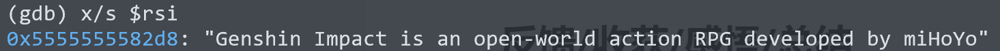

在phase_4的输入串末尾加上原神圣经，即可成功进入secret_phase。


进入secret_phase之后，我们不难发现这个函数调用了fun7这个函数，而这又是一个递归函数。这个函数接收4个参数，事实上实现了在一个半链式半顺序存储的8*8大小的二维数组构成的迷阵中依据输入串作为指令进行移动，依次通过指定位置后到达终点的迷宫寻路问题。

由于这个函数较为复杂，以下先进行代码翻译在进行详细介绍，其中一些细节已经在注释中得到体现：

``` c++
bool fun7(int *scorePoint, int coordinate, int score, string *ins);
void secret_phase() {
    int scorePoint[4] = {5, 4, 3, 2, 1};
    string *ins = read_line();
    if (string_length(ins) > 0x46) explode_bomb();
    if (fun7(scorePoint, 0, 0, ins)) { 
        phase_defused(); // 省略输出信息
        return;
    }
    explode_bomb();
}

bool fun7(int *scorePoint, int coordinate, int score, string *ins) {
    int movement[4][2] = {0, 0, 1, -1, 1, -1, 0, 0}; // 根据ins指向的字符确定移动方向
    int x = coordinate > 0 ? coordinate / 8 : (coordinate + 7) / 8;
    int y = coordinate > 0 ? coordinate % 8 : (coordinate + 7) % 8 - 7; // 展开当前坐标为二位形式
    if (x == y && x == 7) {           // 终点坐标为(7, 7)，即最右下角的位置
        if (score != 4) return false; // 未经过所有得分点提前到达终点，判失败
        else return *ins == '\0';     // 到达终点且没有后续移动指令指令即表示成功
    }
    int move = *ins % 4; 
    x += movement[move];
    y += movement[move + 4];          // 根据move和移动数组确定方向
    if (x < 0 || y < 0) return false; // 此处并没有忠于原文，原文的或运算实际实现了正负号的判断
	Node* arr = head;                 // head为某个链表的头指针，可以通过内存访问
    if (y > 0) {
        for (int i = 0; i < y; i++) arr = arr->next; 
        int elem = arr->data[x]; // 遍历链表，找到坐标为(x, y)的数字         
    }
    if (elem == 1) return false;            // 迷宫中1代表墙体
    if (elem == scorePoint[score]) score++; // 经过得分点，分数自增
    x += y * 8;                             // 将坐标压缩为一维存储
    ins++;                                  // 指向下一个移动指令
    return fun7(scorePoint, x, score, ins); // 进行下一步操作
}
```

根据翻译，secret_phase函数除了调用fun7以外还定义了一个数组用来存放所有得分点。

在fun7的解读中，较为抽象的部分是开头对于坐标展开的部分，包含大量位移，赋值和分支。但是在后续不难发现似乎是按照两个变量在某个数组中进行寻找，因此反推回去就容易理解所谓“坐标”的意思了。而又因为唯一返回 true 的可能位置必须要score为4，且坐标为(7, 7)，而score增加的唯一方式就是通过secret_phase定义的数组所指示的目标点。综上我们不难推断出，这是一个类似于迷宫寻宝游戏的函数。

对于移动指令，由于'0'的ASCII码为48，为4的整数倍，我们不妨以0，1，2，3作为指令，则通过移动数组不难推断出，0即向右一步，1为向左一步，2为向下一步，3为向上一步。

使用` (gdb) x/28x $r9`可以查看链表状态，如下图：

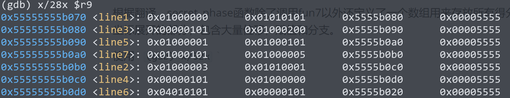

发现最后一个结点的指针域指向0x55555555b020，使用` (gdb) x/4x 0x55555555b020`可以查看这个结点，如下图：

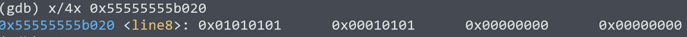

这个结点的指针域为空，故为最后一行，由于是GNU linux平台下采用小端存储，可以画出如下迷宫示意图：

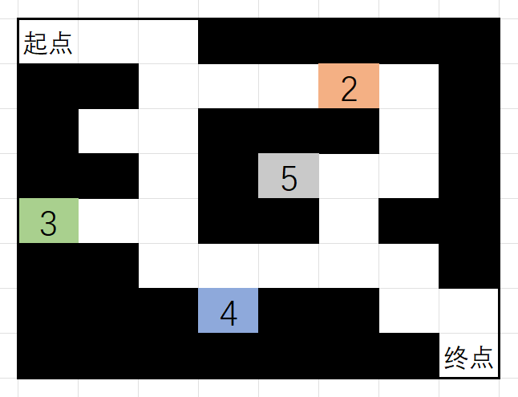

而我们需要依次经过5、4、3、2四个得分点最终到达终点，输入指示方向的指令即可，问题得到解决。


## 反馈/收获/感悟/总结

这个lab的前6个常规phase都比较简单，不用花很多时间，几乎按照字面意思直接人肉IDA就可以做出来；secret_phase相对复杂一些，需要花一些时间理解一下fun7在做什么。个人认为phase_4和secret_phase是两个设计的非常好的题目，看完汇编不太理解，但是经过翻译和模拟就会突然醍醐灌顶，也把很多别的知识贯通了起来；phase_5的设计有些不明所以无论是字符串还是数组在前两个phase都已经涉及，这个字符替换的加密也并不困难。

这个lab我觉得非常有意义也非常有趣，让我阅读汇编代码的能力得到了明显的提升，我个人的心得是要在大量的jmp指令中拆解出实现特定功能的闭环，这对于理解整体功能非常有帮助。正如同Bryant教授和O'Hallaron教授在CSAPP的致谢中提到的，这是一个 'lengendary' 的实验。


## 参考的重要资料

1. 在学习之初，我对函数调用和栈区内存以及相关指令、寄存器作用以及为什么要这么设计有非常多的疑问，以下几本书给了我很大的帮助，它们分别是：
   - Reverse Engineering for Beginners Vol. 1, by Dennis Yurichev
   - x86-64 Assembly Language Programming with Ubuntu, by Ed Jorgensen
   - Computer Systems: A Programmer's Perspective, by Randal E. Bryant & David R. O'Hallaron
2. 在我开始做phase_3时还没有讲到跳转表，同时在phase_4对于递归函数的翻译过程中的一些不熟悉的问题，一名来自HNU的不知名学长的博客对我起到了莫大的帮助：[CSAPP Bomblab 题解 (skywt.cn)](https://skywt.cn/blog/csapp-bomblab/)，为了感谢这位学长，本报告采用了与博客近似的文风以表致敬。
3. 一如既往地，在一些指令的细节和gdb工具的使用上，部分参考了来自ChatGPT的回答，链接：[ChatGPT](https://chatgpt.com/)
