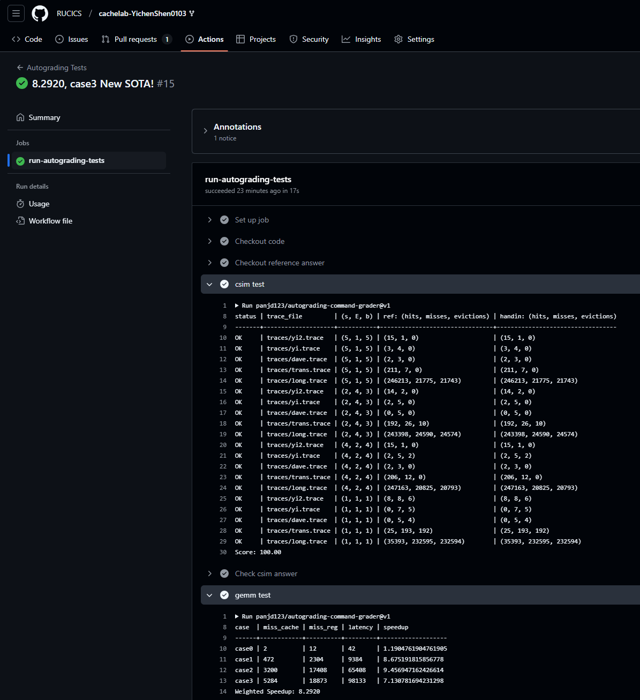
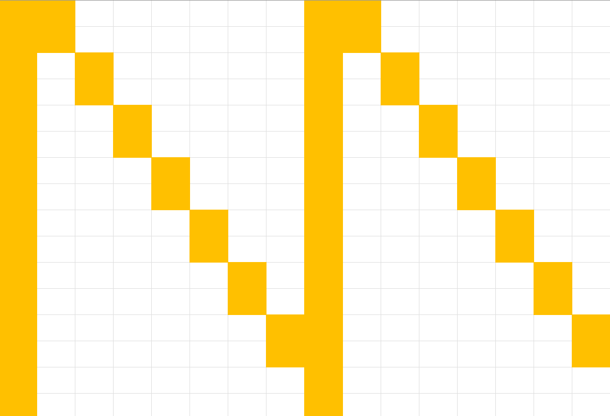
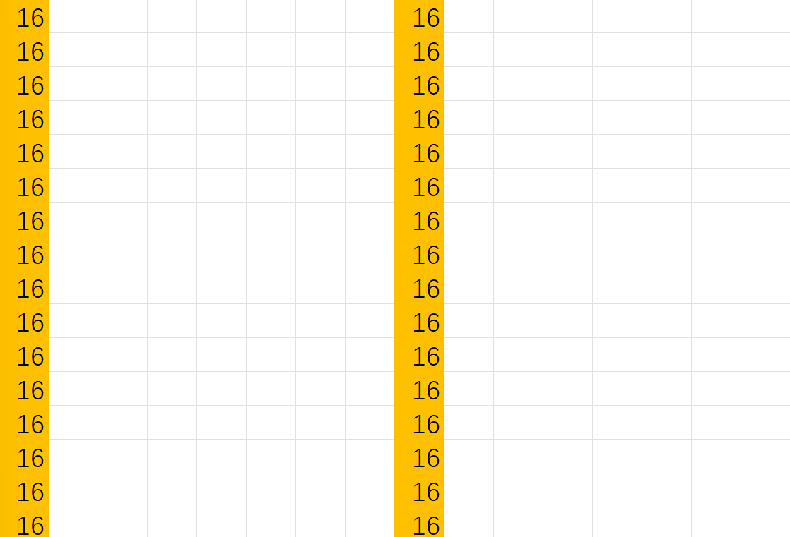
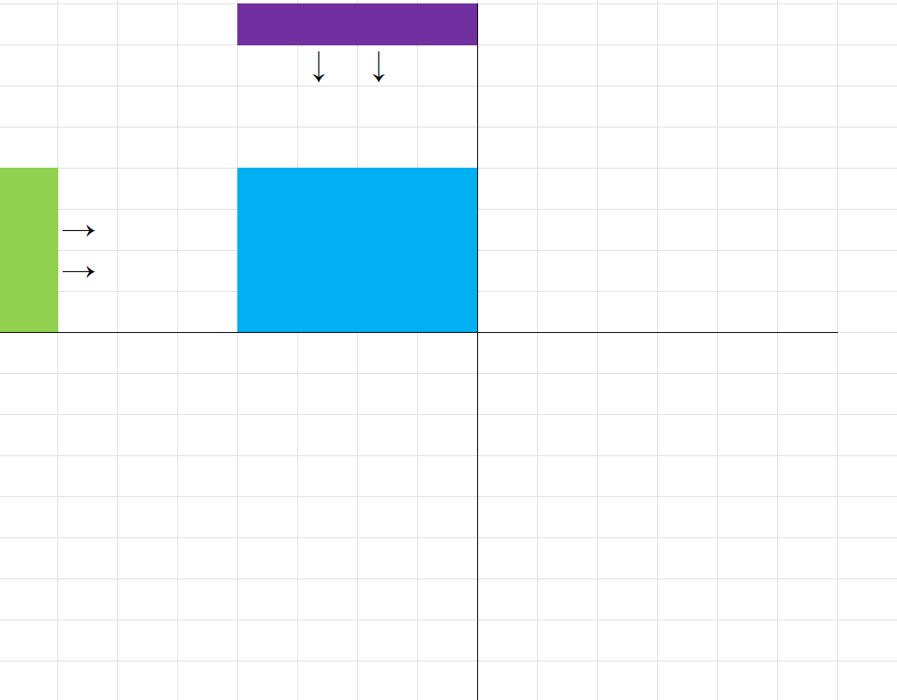
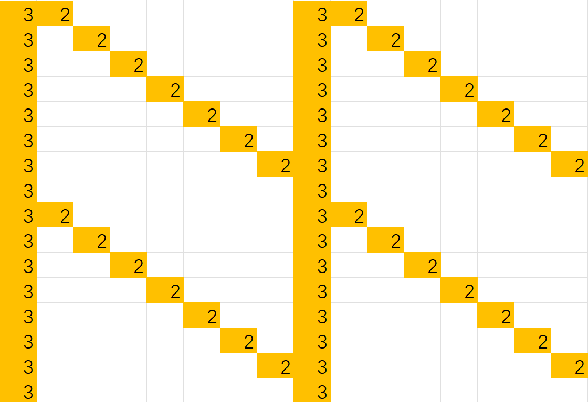
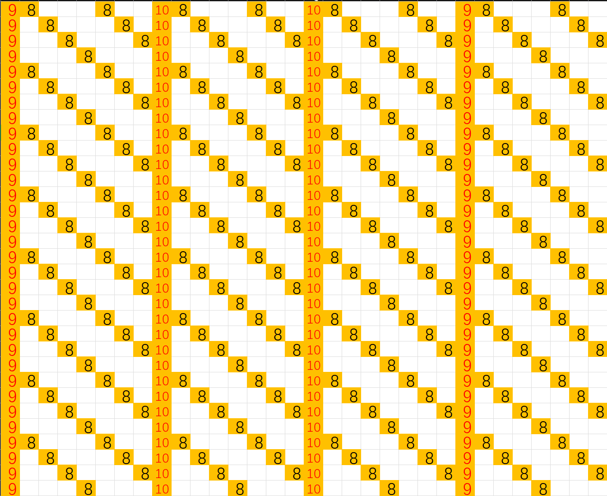
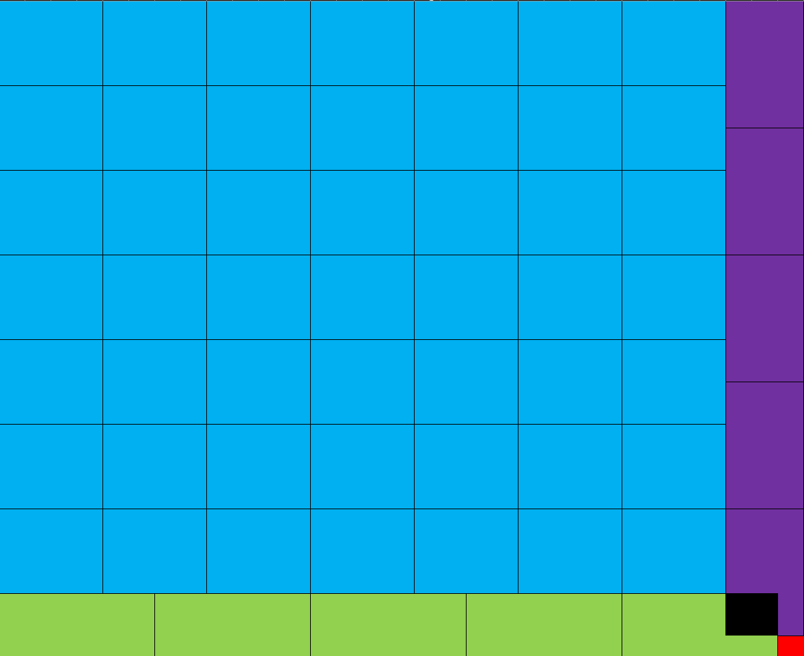
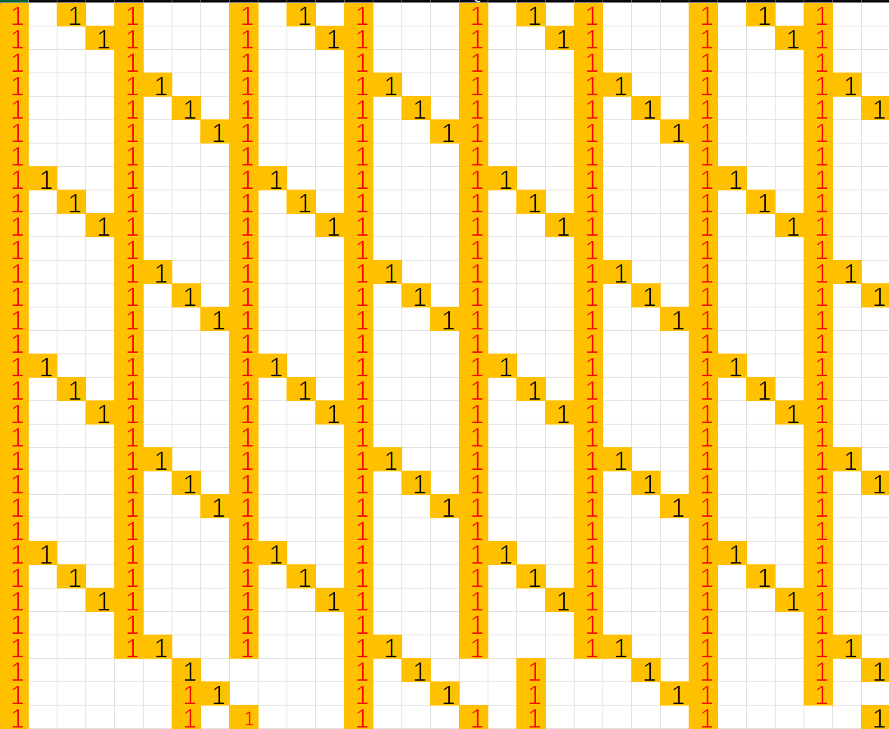
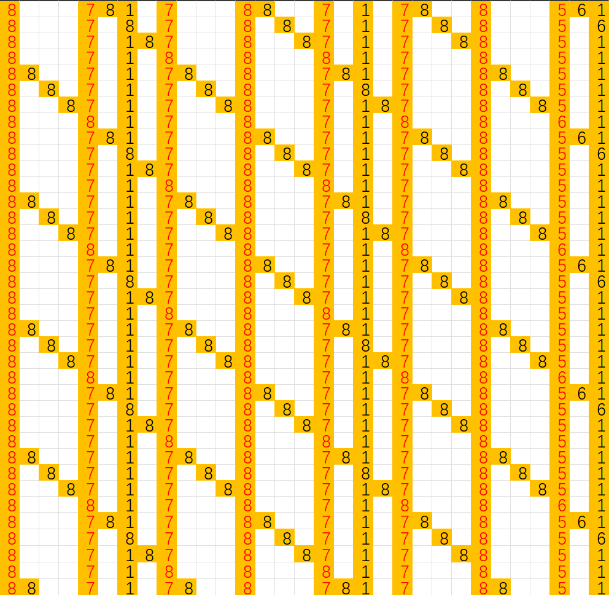
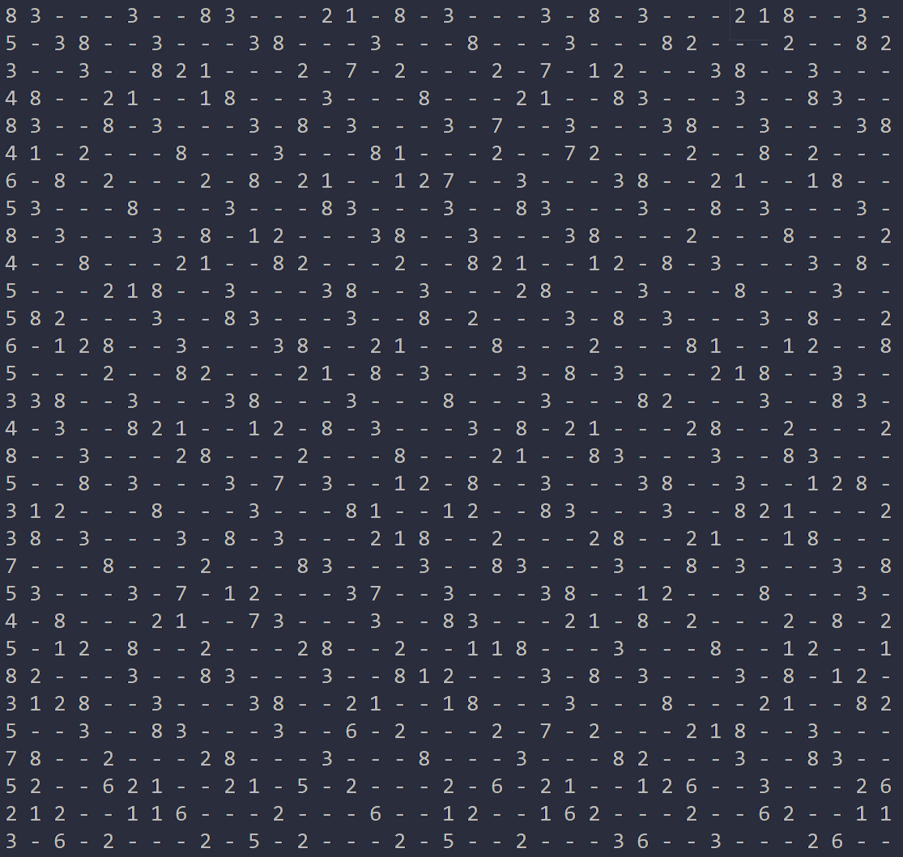

# CacheLab 报告

姓名：xxx

学号：2023202128

| csim 分数 | case1 speedup | case2 speedup | case3 speedup | weighted speedup |
| --------- | ------------- | ------------- | ------------- | ----------------- |
| 100.00   | 8.68     | 9.46 | 7.13          | 8.29             |

Autograder 截图：




## Part A: cache 模拟器

### 实现简述

可以将Cache抽象为一个二维数组，其中每个元素都是一个CacheLine，特别的还需要定义一个int类型的“当前时间”。CacheLine 结构体的设计包括一个布尔类型的有效位、tag以及一个 int 储存上次访问的“时间”。

每当一个访问出现，首先自增当前时间，算出所在的set并在set中寻找tag判断是不是命中，如果命中，更新上次访问时间；如果不命中则找到上次更新时间最小的一个CacheLine进行替换即可。


### 亮点


## Part B: 矩阵乘法优化

### 亮点

1. 分块：利用空间局部性，将大矩阵划分为若干个小矩阵进行计算，提高 cache 复用率。
2. 凑分块：对于case3，由于形状不规整，将大矩阵先分成四个中间块，保证这四个中间块均可以分块，再利用对中间块的再分块即可实现优化
3. 分层利用 cache 和寄存器：由于有一层 32 个寄存器，当分块足够小的时候，可以将一整行读入寄存器，甚至将一整个分块读入寄存器，如此可以提高寄存器的复用率。

#### 我认为的最优秀的实现排序

1. case3（SOTA，连续自破极限）
2. case1
3. case2

### case1

> ⚠ 由于case 1和case 2 采用了几乎相同的优化方法，因此主要在 case 1 中把思路介绍明白，可能画更多的字数，case 2 会简短一些。由于字数超过了，先指出**最终优化是最重要的优化**。

#### 第一次优化

拿到题目，第一感是一定要让 B 跨行连续访问消除，这是因为跨行访问每一次都必定 miss 。因此我们希望对 B 也按照行顺序进行访问，这也就意味这同一轮中的结果没法写入 C 的同一个位置，而我们也会希望写入 C 的位置最好也是按行连续的，因为 C 写入连续与否决定了对 A 的访问能不能连续。

顺着这个思路我们思考 C 的每一行（假设是第 i 行）是怎么算出来的，选定 A 的第 i 行第 j 列元素，他会一次和 B 的第 j 行的每个元素相乘并依次累加到 C 的各个元素上，因此我们只要依行序访问 A ，对每一个元素按照含行序访问 B 的对应行即可。

**说白了，就是将 A * B 分解为 A 的每一行乘上 B 得到 C 的一行，**同时改变顺序，使得 B 在访问中行优先。

伪代码实现如下:

```c++
loop i 0~15:
    Init register array c_line_i[16] = {0...0};
    loop j 0~15:
        select A[i][j] as tmpa;
        c_line_i[k] += tmpa * B[j][k] for k in range(0, 16);
    Write c_line_i into C[i];
```

这个优化的加速比是 5.96，cache miss 604，register miss 4608，这已经是一个不错的结果了，有了巨大的提升但是还可以优化。

我们来分析一下这个方法的 miss：

A 矩阵如下，对于每一行，除了最后两行总能找到一次和 B 的读取相冲突故除了常规的一行两次还要多两次，故共 miss 60 次：



B 矩阵如下，黄色部分的数字表示 miss 的次数，由于每轮共 512 次：



C 矩阵与 B 类似，但是由于每轮只有写回的时候会 miss，每个格子仅 miss 一次，共 miss 32 次。

综上，理论上分析，这个优化的 cache miss 是 604 次，与实际相符。


#### 第二次优化

另一个常见的增强数据局部性利用的方法就是对矩阵进行分块，顺着这个思路，我们还可以进一步优化。

由于一个 cache line 刚好可以放下半行数据，我们最简单的想法就是将这个矩阵分成 4 个 8*8 的小矩阵。由于分块矩阵的性质，我们可以利用小矩阵作为基本运算单元，然后小矩阵运算结果在大的结果矩阵中归位后累加起来就是最终的结果。

据此，我们可以写出以下伪代码来展现这个思路，注意在代码中有两个超参数，也就是分块的大小和外层循环中 ijk 的顺序，以下代入的超参数均为枚举后推定为最优的结果：

```c++
loop k 0~16, step 8:
    loop j 0~16, step 8:
        loop i 0~16, step 8:
            loop ii i~i+8:
                Read C[ii][j:j+8] into register array tmpc[8];
                Read A[ii][k:k+8] into register array tmpa[8];
                loop kk k~k+8:
					tmpb <- B[kk][jj] for jj in range(j,j+8):
						tmpc[jj-j] += tmpa[kk-k] * tmpb
            	Wrie tmpc back into C[ii][j:j+8]
```

经过这一轮优化，加速比来到了 7.29 的结果，cache miss 下降至了 344 次，虽然 register miss 略有上升，总体有了不错的提升。

这个优化的 miss 分析碍于篇幅就不做展开了。

经过矩阵分块，我们将局部性的特点利用到了极致，所有的 miss 只产生在 cache line 头部，并且利用寄存器和 cache 的分层存储最大程度避免了行之间的冲突。仅从 cache miss 的角度，已经做到了极佳的性能。


#### 最终优化

之所以在上一篇的末尾说到仅从 cache miss 的角度，就是因为我们目前的分块实际上带来了比较大的访存次数，**虽然我们用了不少寄存器，但是我们只是用他们来提前读取一些内容，减少交叉读取带来的 cache 冲突不命中**，对他们的复用性并没有很好的利用。

说到寄存器复用，一下子想到的就是 case 0 中的方法，把一个小块的全部数据和都读进来，然后暴力计算。经过尝试后发现，如果要分到足够读进所有的数据，分块必须非常小，而这导致了更多的额外访存，在加速比看来得不偿失。

那么既然没法读进所有的，我们就要考虑是什么情况让我们在分块矩阵的方法中有了非常高的内存访问，在这里其实是我们对 C 矩阵的反复读入写回是非常不必要的。如果我们考虑把注意力集中在 C 的小分块上，并通过投射到 A，B 的对应区域，将这些区域按照规则进行计算，会不会更好呢？这样我们一次就解决了一个小分块，也就无所谓反复读写了。

> 注：此处参考了 CacheLab 文档中的后记部分引用的博客中的思路。

**To make it clear，这个思路与之前的方法的核心区别是注意力的转移，之前我们以 A、B 的分块为主要关注点，利用分块矩阵乘法公式，而现在的思路则是对 C 的分块更加关注，再去回推 A、B 怎么分割可以产生这个小矩阵**

至于分块大小的选择，我们希望这个分块可以尽量大，又要在寄存器中装得下，经过测试，最终选择了 4 * 4 小块分割（这个分法相对比较显然，太小了利用率和复用能力都不强，分块大了寄存器装不下，那就选一个装的下里最大的分法）。

顺着这个思路，我们可以有以下的伪代码实现：

```c++
loop i 0~16, step 4:
	loop j 0~16, step 4:
		Init register array tmpc[4][4];
		loop k 0~16:
			Read A[i][k]~A[i+3][k] as reg array a[4];
			Read B[k][j]~B[k][j+3] as reg array b[4];
			tmpc[x][y] += a[x] * b[y] for (x, y) in {(x,y)|0<=x<=3 && 0<=y<=3};
		Write tmpc into C[i][j]~C[i+3][j+3];	
```

在这个思路下，**我们编写的代码的加速比达到了 8.68，cache miss 和 register miss 分别是 472 和 2304**。虽然 cache miss 有所牺牲，但是 register miss 大幅度下降，最终加速比也获得了不错的提升。

接下来我们重点讨论一下 cache miss 的计算：

矩阵 A 的 miss 是最难计算的，我们在这里采取一种更本质的策略，我们不分析代码而是直接看思路。如下图所示，我们假设蓝色部分是我们目前关注的 C 矩阵小块，我们可以认为随着 k 的循环，A 和 B 分别会以绿色和蓝色两个方向推进 16 次，边推进边计算然后进行累加。那么对于 A 矩阵而言，第一列和第八列一定是每个位置都有 3 次 miss（为什么不是 4 次呢？因为我们分块是行优先的，所以 A 会从同一个位置推出来四次，可以证明至少有一次是可以复用的）。



而对于其他位置，我们会发现，由于 A 的先行性（在代码中我们先读入 A 而不是 B），这导致可能冲突的位置都位于四个“象限”的一条特定斜线上（如下图所示），而且每个位置必定是两次，拿（0，1）举例，这是因为 B 在第一轮和第二轮都会和 A 产生行冲突。以此类推我们就会得到类似下图这样的 miss 分布图，计算总量是 152 次 miss。




对于矩阵 B 和 C，相对是比较简单的，就不展开太多了，B 矩阵每一轮 k 子循环会 miss 一次，又由于外围 ij 层共16次循环，故简单计算得到 256 次 miss；矩阵 C每个 ij 循环层 miss 4次，总计 64 次。

综上我们得出共 472 次 miss，符合预期，与实际相符。与前一种方法相比，C 的 miss 减少了这是意料之中的，主要的额外 miss 开销来自 A 和 B 两个矩阵。


### case2

> ⚠ 如前文所属，这一节会简短一些，没有什么新的思路，主要分析 Naive 算法的 miss。

对于这个 case 并没有想到其他特别好的思路，依然采用 4 * 4 分块并利用寄存器减少访存的方式，伪代码就不放了，只要将前面的代码中的 16 换成 32 即可。

**这一方法的加速比是 9.46，cache miss 是 3200 次，register miss 是17408 次**。

由于方法相似，就不做解释了，以下主要看看 Naive 算法的 miss 分布。

对于 32 * 32 的情况，相比于 16 * 16 会更复杂一些，我们优先考虑最复杂的 A 矩阵，每次顺序读取一行的时候，会产生 miss，如果把 8 列作为一组（刚好读进一个 line），那么 B 有 3 / 4 的概率（B是列序遍历，每一次一定在同一个组）与 A 不会读进同一个 set 也就是可以复用，相当于每个 line 初始位置视情况会累计 9 ~ 10 次（除了正常的 8 次以外还有 1 ~ 2 次是在复用前读进去【同样由于 A 的先行性】，其中首位的两个组加一次中间位置加 2 次【两段复用区间都要开头一次】）。此外，由于与 case1 类似的 A 的先行性，A 矩阵中必然存在若干条 miss 斜线，并且由于 4 行刚好塞满一个 cache，斜线截距的间距应该为 4。又由于只有剩下那 1 / 4 的情况会产生冲突，所以冲突不命中的分布应该每个位置是 8。此外有可能刚好冲突的位置就是一个 line 的起始位置，也就是这个时候本来就应该有 cache miss，这个时候不应该加上额外的 8 次。综上，我们可以画出 cache miss 分布图，总计 miss 次数 3008 次。



B、C 矩阵相对简单，每次访问必定 miss（B 是因为跨行访问，C 是因为和 A 矩阵同行，必定冲突），所以每个位置各自是 32 次 miss 和  1 次 miss。故 B 共计 32768 次，C 共计 1024 次。

综上总计理论 miss 36800 次，与实际相符，并且 B 矩阵对于总体 miss 的贡献达到了 90%，这也可以解释为什么我们的方法对这个 case 优化效果更好，因为我们的方法相对来说会中和三个矩阵的 miss。

由于优化方法与上一个 case 类似，此处对优化算法的 miss 只作简要分析：A 矩阵的先行性不变，所以 miss 图形和 Naive 方法一样，只不过由于局部性的利用，所有的 9 改为 3，所有的 10 改为 4，所有的 8 改为 2，共计 896 次（具体推导可参考上一个 case 末尾的 “推进推导法”），B 矩阵和 C 矩阵均只在 cache line 基址处 miss，由于每个块访问 8 次故 B 每个位置 miss 8 次，C 则是 1 次。

总计 miss 3200 次，与实际相符。


### case3

> ⚠ 此部分由于加了一个伪代码字数略超，相对来说**第二次优化的分块思路和 miss 分析**是我觉得最重要的。

#### 第一次优化（已经为 SOTA 速度）

这个 case 中最棘手的就是C矩阵的形状是 31 * 31，而31 是素数，没法分割。参考了若干关于 CMU CacheLab 解答的帖子，特别是文末所引用的一篇博客的解法，我们可以尝试 “**凑**” 出一个可以分块的矩阵，对于剩下的部分单独处理。

最显然的想法就是凑一个 28 * 28 的矩阵进行 4 * 4 分块，然后对于剩下的部分。再分成 3 * 4 的小块单独处理（如果剩下部分直接用 Naive 方法算效果较差此处不做展示了），具体分块如图所示，蓝色部分（28 * 28）采用 4 * 4 分块，其他部分采用 3 * 4、4 * 3、或者 3 * 3 分块。


伪代码实现如下：

```c++
// top left
loop i 0~28, step 4:
	loop j 0~28, step 4:
		Init register array tmpc[4][4];
		...similar to case1, accumulate tmpc...
		Write tmpc into C[i][j]~C[i+3][j+3];
// bottom left
loop j 0~28, step 4:
	Init register array tmpc[3][4];
	...similar to case1, accumulate tmpc...
	Write tmpc into C[28][j]~C[30][j+3];
// top right
loop i 0~28, step 4:
	Init register array tmpc[4][3];
	...similar to case1, accumulate tmpc...
	Write tmpc into C[i][28]~C[i][30];
// bottom right
Init register array tmpc[3][3];
...similar to case1, accumulate tmpc...
Write tmpc into C[28][28]~C[30][30];
```

如此优化使得加速比来到了 6.89，已经来到了报告写作时的 SOTA 水平，cache miss共计 5485 次，register miss 共计 19313 次。由于我们还有下一步优化，并且大致思路与这个相似，所以此处先不分析 cache miss，等到优化完再分析。


#### 最终优化（新 SOTA）

目前来看我们对于除了 28 * 28 这个位置其他部分的分块策略都是比较保守的，对于寄存器的利用率没有那么高。那么如果我们想试探一下寄存器利用的极限在哪里，可以怎么做呢？

根据测试，最佳的剩余部分分块可以来到 3 * 6，6 * 3 加一个 1 * 1！如图所示，会有 2 * 2 重叠（图中黑色部分），经过进一步测试但是这部分重叠的存在想要去掉只会有负优化（因为如果再作不规整的划分，cache 复用性会显著下降）：



由于代码结构相似，只是调整了一些参数，因此伪代码就不做展示了。

**这个优化后加速比来到了 7.13，cache miss 来到了 5284，register miss来到了 18873**。

下面我们来分析这个算法的 cache miss：

由于不是 8 的整倍数，所以数据在内存中的排布会有些偏离，我们优先看最简单的 C 矩阵，首先明确 C 的开始地址就是没有 8 对齐的，C[0] 的首地址实际上已经是一个 line 中的第七个位置了，这也就意味着第一行读到第三个就会产生新的 miss，以此类推，其中小分块内部也是一样的，总共每个块读一遍，我们可以得到类似的图示（如下图），加起来对于 C 矩阵就会 miss 331 次。



再看 B 矩阵，B 矩阵的读取也比较顺序，同理由于 B[0] 的第一个地址就在一个 cache line 第 4 个位置，所以读取到第六个位置的时候会产生额外的 miss，以此类推可以画出这个矩阵的大斜线，至于具体值，由于一共循环七轮，所以每个四小格的开头至少 7 次，斜线内也是 7 轮。对于最后三列，每个格子访问五遍，并且同样由于不对齐的问题会产生额外的斜线。此外在处理 C 的左下角，实际上会将 B 按照 6 个一读再读一遍，故相当于大斜线每个位置加一，并且每个六小格的开头都加上一次 miss，画出示意图如下所示：

> 由于此处确实比较复杂，文字可能难以表述清楚，直接看示意图再理解会更好。



至于 A 矩阵，实在是分析难度过大，我们只做估计，并给出一个由代码生成的实际 miss 分布图。好消息是 A 的首地址至少是 cache line 的第一个位置，我们用第一行第一轮的结果去近似估计每一行每一轮。对于第一行第一轮，首先顺序读取会导致 8 次 miss，并且在B向下推进的过程中大致产生 8 次冲突（由于）所以第一行第一轮产生了 16 次冲突，由于一共 31 行，每行 4 轮，估计最终结果大致 miss 31 * 4 * 16 = 1984 次。实际的 miss 分布如下图，共 1892 次，预计是由于推进过程中不一定会 miss 这么多次（7 ~ 8 次，但以 8 次居多），并且可能由于分布问题存在着隐晦的复用。



> 画出这一副图的代码在 **附录** 部分有展示。

通过脚本的计算我们还发现，B 矩阵中也有 3 次比较隐晦的复用导致的没有 miss，所以我们估计的总 miss 5379 次，比实际的 5284 次多了一些。


## 反馈/收获/感悟/总结

这个 Lab 应该是我写的最痛苦也是耗时最久的一个 Lab 了，在最后几天前我还卡在 5 左右的加速比心惊胆战的调整参数，只为了零点几的优化。

个人认为这个 Lab 的第一部分是非常好的，理解一个东西最好的方式就是自己模拟着还原一遍，对于我理解 cache 有了很好的帮助。

第二个部分我个人感觉设计寄存器和 cache 两层是非常有趣的，特别是通过优化的过程，我很明显的感觉到了多级cache的利用是有很明显的提升的。矩阵乘法的优化相比于转置又是一个更困难，同时非常实践性的课题。

此外，分析各个算法的 cache miss 虽然痛苦，但看到结果和自己的预期一样的时候还是很有成就感的，也学到了很多。

虽然感觉有点偏难（可能只是我在一开始没找对方法，相比于其他lab），但是这个 lab 对我的理解 cache 是很有帮助的。


## 参考的重要资料

1. 一篇关于CMU CacheLab 的讲解博客，其中关于 case 3 的优化对我优化矩阵乘法的 case3 提供了很好的思路，利用他的思路，我的case3 达到了排行榜中的 SOTA 水平（至少这篇报告完工前），感谢这位好心的匿名学长，为了致敬本报告采用了相似的行文风格。链接：[CSAPP - CacheLab (d-sketon.top)](https://d-sketon.top/20211015/csapp-cachelab/)

> 注：此处仅用一篇对我帮助最大的 Cachelab 博客作为代表，同时感谢其他若干篇我曾翻阅过但是没有保存下来的博客，它们为我的思路奠定了基础。

2. CacheLab文档末尾的后记，对于我进行矩阵分块优化的整体思路有关键的启发，让我在 16 号一个下午极限从 5 的加速比冲到了 8。本文在 case1 的 ”最终优化“ 篇章最这篇文章专门写注致敬，链接：[深入浅出GPU优化系列：GEMM优化（一） - 知乎 (zhihu.com)](https://zhuanlan.zhihu.com/p/435908830)

> 注：此处同时感谢一位不愿透露姓名的同学，在 16 号寒冷的下午我向他寻求思路上的启发时推荐我去看了这一篇后记。

3. ChatGPT-o1（~~太好了是大模型我们有救了~~），对于如何将《后记》中的思路写成代码并且高效利用寄存器，o1 生成的代码对我有很大的帮助，借鉴了它的代码架构，链接：[ChatGPT](https://chatgpt.com/)

> 注：此处不感谢 4o 及以下的版本，它们似乎理解不了我想说什么。


## 附录

关于 case 3 中采用的查看 miss 分布的脚本：

在项目根目录下有以下目录结构：

```c
/- show_miss
	|- show_miss.py
    |- miss.txt
|- csim-show
|- (...other files...)
```

在**项目根目录**下运行以下命令，其中除了 -h 均为必选参数。

```bash
python3 show_miss/show_miss.py [-h] [-n NAME] [-r ROW] [-c COL]
options:
  -h, --help            show this help message and exit
  -n NAME, --name NAME  矩阵名
  -r ROW, --row ROW     矩阵的行数
  -c COL, --col COL     矩阵的列数
```

脚本的代码如下：

```python
import argparse
import os

def main(case, matrix_name, rows, cols):
    os.system("./csim-show -s 4 -E 1 -b 5 -t ./gemm_traces/case3.trace > ./miss.txt")

    array = [[0 for _ in range(37)] for _ in range(37)]
    count = 0
    with open("miss.txt", 'r') as f:
        for line in f:
            lst = line.split(" ")
            if lst[1] == matrix_name:
                array[int(lst[2])][int(lst[3])] += 1
                count += 1

    for i in range(rows):
        for j in range(cols):
            if array[i][j] != 0:
                print(array[i][j], end=" ")
            else:
                print("-", end=" ")
        print()
    print(count)

if __name__ == "__main__":
    parser = argparse.ArgumentParser(description="统计并可视化 miss.txt 中的 miss 次数")
    parser.add_argument("-n", "--name", type=str, help="矩阵名", default="A")
    parser.add_argument("-r", "--row", type=int, help="矩阵的行数", default=37)
    parser.add_argument("-c", "--col", type=int, help="矩阵的列数", default=37)
    args = parser.parse_args()
    main(args.name, args.row, args.col)
```

由于设计目的只是为了查看 case 3 的问题所以脚本不接受其他 case 的 trace 文件。

csim-show 的源码加上了在 miss 情况下的格式化输出，此处不做展示。
