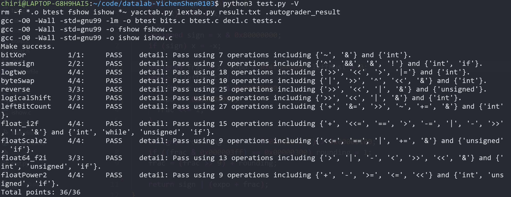

# datalab 报告

姓名：xxx

学号：2023202128

| 总分  | bitXor | samesign | logtwo | byteSwap | reverse | logicalShift | leftBitCount | float_i2f | floatScale2 | float64_f2i | floatPower2 |
| ----- | ------ | -------- | ------ | -------- | ------- | ------------ | ------------ | --------- | ----------- | ----------- | ----------- |
| 36.00 | 1.00   | 2.00     | 4.00   | 4.00     | 3.00    | 3.00         | 4.00         | 4.00      | 4.00        | 3.00        | 4.00        |


test 截图：




## 解题报告

### 亮点

1. leftBitCount
2. logtwo
3. float64_f2i
4. byteSwap
5. reverse

### leftBitCount

```c
int leftBitCount(int x) {
    x &= x >> 1;
    // ...
	// Repeat, set all bits to 0 except for the leftmost consecutive 1s
    // ...

    x += ~((x >> 1) & 0x55555555) + 1;
    x = (x & 0x33333333) + ((x >> 2) & 0x33333333);
	// ...
    // Repeat, group and count the number of 1s
    // ...

    return x & 0x0000003f;
}
```

​		本题的实现思路分两块，首先先把不是左边第一串1的部分全部置0，然后数出有多少个1即可。

​		对于第一部分，核心思路就是将左起第一个0向右扩展。而由于0和任何数字做与运算都是0，所以就可以利用与运算的特性将原数字右移特定位数后与上自身。

​		此处可以利用类似课程PPT中leftmost_one函数的实现，通过第 i 次位移2的 i - 1 次达到快速并行的效果。

​		对于第二部分数1的个数，即经典的求汉明重量的问题在思路上借鉴并优化了课程PPT中bitCount函数的分块计数法，从算法分析的角度来说这一方法无需要求所有1都在最左侧，而经过我的第一步处理所有1都在最左侧了，是相对来说更容易计算的形状，理论上应该可以更快但是碍于笔者的水平限制，暂时没有想到更好的办法。以下将简述这一方法的核心步骤和代码实现。

​		先将相邻的两位分为一组，x += ~((x >> 1) & 0x55555555) + 1 的原型是 x -= (x >> 1) & 0x55555555，目的是如下表所示的计数，也就是在原先的组上实现内由01串向1的计数的两位二进制串表示转变。

| bit_group | count |
| --------- | ----- |
| 01 / 10   | 01    |
| 00        | 00    |
| 11        | 10    |

​		这里的化简需要一定的观察，发现count = bit_group - (bit_group >> 1)，这一步的得出相对有一些跳跃，但是有了这一步之后后续无非就是两位计数通过右移两位和自己相加合并为四位计数，再合并为八位计数，以此类推最后得到了一个32位数也就是最后得到的int记录了整个32位中1的个数。此处有一个减少操作数的技巧，由于最后的计数最多是32，也就是最多是占用6位，而后两次合并产生的高位残留地也只能影响到第九位（如下图例子，用16位模拟第三次合并并未截掉高位残留，但是残留在第十二位在后续的操作中也影响不到第六位），也就是说可以在最后和掩码0x0000003f做与操作舍去高位即可减少上面的一次与操作。

| 状态       | 16   | 15   | 14   | 13   | 12   | 11   | 10   | 9    | 8    | 7    | 6    | 5    | 4    | 3    | 2    | 1    |
| ---------- | ---- | ---- | ---- | ---- | ---- | ---- | ---- | ---- | ---- | ---- | ---- | ---- | ---- | ---- | ---- | ---- |
| 原始       | 1    | 1    | 1    | 1    | 1    | 1    | 1    | 1    | 1    | 0    | 0    | 0    | 0    | 0    | 0    | 0    |
| 计数后     | 1    | 0    | 1    | 0    | 1    | 0    | 1    | 0    | 0    | 1    | 0    | 0    | 0    | 0    | 0    | 0    |
| 一次合并后 | 0    | 1    | 0    | 0    | 0    | 1    | 0    | 0    | 0    | 0    | 0    | 1    | 0    | 0    | 0    | 0    |
| 两次合并后 | 0    | 0    | 0    | 0    | 1    | 0    | 0    | 0    | 0    | 0    | 0    | 0    | 0    | 0    | 0    | 1    |
| 三次合并后 | 0    | 0    | 0    | 0    | 1    | 0    | 0    | 0    | 0    | 0    | 0    | 0    | 1    | 0    | 0    | 1    |

​		返回结果的第六位，问题成功解决！

### logtwo

```c
int logtwo(int v) {
    int ans = 0;

    int tmp = (v > 0x0000ffff) << 4;    // Judge if it is necessary to handle the left
    ans |= tmp;    // Use 'or' to emulate '+'
    v = v >> tmp;    // Right shifting to prepare for next operation 
	// ...
    // Repeat the same step for several time, using the same thought as binary search
    // ...

    return ans;
}
```

​		很自然地想到本质是寻找最左边的1，为了节省搜索成本很显然可以利用二分查找，主要难点在于不能使用while如何判断何时结束。

​		解决方法抽象来说就是不结束，同时将指针指示位置改为累加，通过条件判断来看要不要继续累加即可。

​		具体来说，先比较原数是否大于0xffff，如果大于了，那就加16（通过或来模拟，不会冲突的原因是我们每次加的都是2的倍数，操作的位是不同的，因此不会冲突），并且右移16位，小于的话就不变，直接进行下一步。此处的具体实现就是利用16、8、4、2、1都是在二进制中只有一位1，就可以用0x1左移几位来实现，而0x1又可以通过比较产生（即true）因此就可以定义一个tmp来存这个数字。ans的累加量和v的位移量均可以用tmp表示。

​		后面依次比较是否大于0xff，0xf，0x3，0x1即可。

​		返回ans，问题成功解决！

### float64_f2i

```c
int float64_f2i(unsigned uf1, unsigned uf2) {
    int rightShift = 1053 - ( /* This part is exponent */ >> 20);    // Use rightShift instead of exp to simplify operation
    if (rightShift > 30) return 0;    // Cases whose rightShift is too large
    if (rightShift < 0) return 0x80000000;    // Cases whose rightShift is too small

    int val = ( /* This part is fraction */) >> rightShift;    // val is at most 31 bits
    if (uf2 & 0x80000000) return -val;    // Dealing with signed number
    return val;
}
```

​		本题的实现依然暴力，但是简化操作的细节非常多。

​		先看总体思路，也是分三个部分。对于符号部分由于可以用if和负号，直接在最后做判断按需取相反数即可。

​		对于尾数和指数部分，先给出以下引理：

> 引理：不考虑结果为溢出情况、- 2 ^ 31和0，尾数部分有效位数至多30位，指数部分必定小于等于30大于等于0

​		下面给出证明：

> 证明：
>
> Ⅰ先看指数部分，由于int的边界为 ± 2 ^ 31 - 1（已经声明不考虑 - 2 ^ 31），当这个数充分大时，必定为规格化表示，故尾数部分至少为1，若指数大于30，显然结果的绝对值大于等于2 ^ 31，不可能，故指数部分小于等于30。
>
> Ⅱ 再看尾数部分，由于指数最多只有30，假设尾数多于三十位，则必定经过指数的乘方依然存在小数，又由于题目说向下取整，小数必定被舍去，显然为无效位数，故尾数部分有效位数至多30位。

​		有了这个引理我们再来考虑，先考虑不满足引理的边界条件。

- 若结果为溢出或 - 2 ^ 31，结果均返回0x80000000，因此可以一起处理，此时指数必定大于30，故在正是处理前预加一重判断即可；
- 若结果为0，即规格化的指数小于0部分和非规格化，可以一起处理为指数部分小于零，条件判断并返回0即可。

​		排除所有特殊情况后，引理对剩下情况都成立，注意到剩下的一定为规格化，且尾数部分加上隐藏的1也最多只有31位。因此可以用一个int形数存下。即这个部分为一个前导1、uf2的低20位、以及uf1的高10位，利用掩码和位移切片拼接即可。对于指数部分直接对uf2用掩码切片即可。

​		为了最大程度简化运算，将指数部分在切片时即转为实际的尾数部分右移量。前文说到的有很多细节实际上已经在分析过程中被细腻的融入其中了，包括一些边界的合并等等技巧。

​		最后写下简洁的5行代码，问题完美解决！

### byteSwap

```c
int byteSwap(int x, int n, int m) {
    n = n << 3;    // Construct the mask of nth byte
    m = m << 3;

    int diff = ((x >> m) ^ (x >> n)) & 0x000000ff;    // Transmit the difference of the two bytes

    return x ^ ((diff << m) | (diff << n));    // (x ^ y) ^ x = y
}
```

​		本题想要得到正确结果不难，直接通过两个掩码获取两个byte然后通过<<和>>移动最后拼起来即可，难点在于如何用更少的的操作实现。而题目中允许使用异或成为了关键

​		我的解法核心利用了异或的运算性质（ x ^ y ) ^ y = x，我的理解是 x ^ y 的本质是x和y的一种差量(diff)，因此我们不需要转移具体的位，只要得出差量后将差量做成一个mask贴到原二进制串上即可。

​		此处还有一个减少操作的技巧，就是将n和m位的字节均位移到第一个字节比较，可以有效减少由于题目不允许使用减号带来的定位相对位移所需要的额外符号使用，也就是说找到n和m的偏移量并在后续调用的成本大于干脆把他们全放到第一位去比较。

​		照着这个思路写处代码，问题解决。

### reverse

```c
unsigned reverse(unsigned v) {
    unsigned slice_left = (v & 0xaaaaaaaa) >> 1;    // Group every two adjacent bits together and swap
    unsigned slice_right = (v & 0x55555555) << 1;
    v = slice_left | slice_right;
	// ...
    // Similar to logtwo, repeat the operation above, untill exchange the left 16 bits and the right 16 bits 
    // ...

    return slice_left | slice_right;
}
```

​		这题让我想起了做过的一个算法题，是实现一种字符串的环状偏移比如 "abcdef" 右移三位是 "defabc" ，用python方法就是先反转两个部分再整体反转。

​		虽然看上去两个题目思路没什么关系，但是这种局部反转和全局反转的组合所能产生的微妙关系确实启发了我，通过局部交换位置能不能是实现全局的反转呢？顺着这个思路，我们先通过两个掩码并行选中相邻两位交换并作为一个新单元，再交换相邻的两个新单元，以此类推直到交换前16位和后16位。

​		输出结果，问题解决！

### floatScale2

```c
unsigned floatScale2(unsigned uf) {
    unsigned expoAndfrac = uf & 0x7fffffff;    // Group expo and frac since frac will not be operate singly
    unsigned expo = uf & 0x7f800000;   
    // ...
    // Four branches for INF and NAN, nearly overflow, denormalized and normalized conditions
    // ...

    return (uf & 0x80000000) | expoAndfrac; 
}
```

​		本题依然分三个部分解决。

​		对于符号部分，*2是不改变的，因此直接保留即可。

​		对于指数和尾数部分，需要分很多情况考虑。

- 如果本身是NaN或者无穷，返回本身即可；

- 如果expo离无穷只差1，*2必定为无穷；
- 如果expo为零，即非规格化，由于ieee754的特性，规格化和非规格化是平滑连接的（bias差一），直接将expo和frac整体左移一位即可实现统一的模拟需要转规格化和依然为非规格化的两种情况；
- 其他情况，即正常规格化，只要让expo加一即可。

​		此处也有减少操作数的方法，注意到没有任何操作是单独对frac进行的，那直接将frac和expo视为一个整体即可，又由于expo需要频繁的判断，单独提出来一个变量，而frac则不需要单独一个提出。

​		将符号位和expoAndfrac拼接，问题成功解决。

### float_i2f

```c
unsigned float_i2f(int x) {
    if (!x) return x;    // Prevent infinite loop caused by 0

    unsigned sign = x & 0x80000000;
    if (sign) x = -x;    // Avoid logical confusion caused by signed numbers

    unsigned frac = x, expo = 0x4f800000, leftMost = 0;   
    // ...
    // Use while-loop to shift frac to the left, untill left most bit is 1
    // ...

    unsigned rounding = (frac & 0x000001ff) > 0x00000100;
    if ((frac & 0x000003ff) == 0x00000300) rounding = 1;
    frac = (frac >> 9) + rounding;    // Little tricks: ignore the possible overflow to simplify operation

    return sign | (expo + frac);    // Use '+' instead of '|' to deal with the overflow condition
}
```

​		浮点数的题目相对都比较暴力，都是分三个部分考虑最后做拼接。

​		对于本题，尾数部分整数必定是规格化表示，由于可以使用循环，我们可以直接左移这个数字，并通过判断最高位是不是1来决定何时终止。然后通过rounding判断后面的残余部分存在与否，若有则要进一，然后处理向偶数舍入（round to even）的原则，即判断最后剩的数字是不是只有最低位是1且残余部分最高位为1，若是也要进一。

​		指数部分随着循环的进行用一个数字来计数即可，此处可以将expo预设为0x4f800000，计数改为递减0x00800000可以有效降低操作数。

​		符号部分直接与上0x80000000即可。

​		此外还有两点注意，首先由于进位可能导致尾数部分溢出干扰指数部分，所以将expo | frac，改为expo + frac，使这个进位可以平滑连接两个部分，即后者的进位刚好向上给指数部分加了一。其次就是对于x <= 0的情况，等于零的时候后面会变成死循环，单独处理返回0，小于零的情况由于补码的存在后续全部进行不了，直接取相反数即可，符号位已经被考虑了。

​		返回三个部分的拼接，问题成功解决。

### samesign

```c
int samesign(int x, int y) {
    if (x && !y) return 0;
    if (y && !x) return 0;    // Dealing with one of x and y equals 0 while the other doesn't
    return !((x ^ y) & 0x80000000);    // Other conditions can be solved by unified expression
}
```

​		作出如下表格:

| x    | y    | Is Sign Bits the Same? | return |
| ---- | ---- | ---------------------- | ------ |
| 0    | 0    | 1                      | 1      |
| (-)  | 0    | 0                      | 0      |
| (+)  | 0    | 1                      | 0      |
| (-)  | (-)  | 1                      | 1      |
| (+)  | (+)  | 1                      | 1      |
| (+)  | (-)  | 0                      | 0      |

​		我们先考虑符号位不同就可以解决的情况，即x和y的符号位不同，则返回0。显然表中大部分情况可以解决。

​		然后我们处理符号位判断和实际返回不一样的情况，即一个为负数一个为0，考虑到判断负数有额外的操作，同时注意到一个为正一个为零也是可以返回1的，所以可以合并为一个判断，即一个为零一个不为零就返回1。

​		至此问题解决。

### floatPower2

```c
unsigned floatPower2(int x) {
    if (x >= 128) return 0x7f800000;  // Overflow conditions
    if (x <= -150) return 0;    // Too small for even denormalized condition
    if (x >= -126) return (x + 127) << 23;    // Normalized conditions
    return 0x00000001 << (149 + x);    // Denormalized conditions
}
```

​		本题相对简单，可以使用if，只要按照不同的情况表示即可。

​		先找边界条件，32位浮点数的指数8位，偏移量为127，规格化的情况可以表达的指数范围是 - 126 ~ 127，非规格化表达的指数是 -126，尾数共23位，故可以表达的最小指数是 - 149 次。

- 对于指数大于等于128次的溢出情况，直接按题目要求返回正无穷即可；
- 对于非规格化都无法表示的过小的情况，即指数小于 - 150，直接按照题目要求返回0即可；
- 对于规格化情况，即指数部分大于等于 - 126，此时尾数部分有前导1，因此实际表达全为0，符号位也为0，只要考虑指数部分即可，返回 x 加上偏移量并位移到指定位置即可；
- 对于非规格化情况，即剩余所有情况，此时符号位和指数为全为零，只要考虑尾数即可，尾数没有前导1，因此只要返回1左移相应的次数即可；

​		综上四个分支，问题解决。

### logicalShift

```c
int logicalShift(int x, int n) {
    return (x >> n) & (((0x7fffffff >> n) << 1) | 1);    // Use mask to offset the 1s generated automatically
}
```

​		解法并不漂亮，暴力解决。

​		由于int类型的右移会在高位补1，那思路就是把这n个1换成0，具体实现就是将0x7fffffff（除了最高位都是1）向右移 n - 1 位作为一个掩码，由于不能使用减号，那就先右移n位再左移1位。此处会产生一个边界条件的混乱，如果原函数传入的n是31时，掩码右移31位后会变成0x0，此时左移1位还是0x0，为了保证最后必定留下了一位（如题目中假设的那样 n <= 31），所以将掩码最低位通过和1进行或运算强行设成1。

​		按照这个思路，先强行右移再和掩码做与运算，问题解决。

### bitXor

```c
int bitXor(int x, int y) {
    return ~(x & y) & ~(~x & ~y);
}
```

​		通过逻辑运算进行化简，最后一步运用了德摩根定律

​	   (x ^ y) 

​	= (x & ~y) | (~x & y) 

​	= ~((~x & ~y) | (x & y)) 

​	= ~(x & y) & ~(~x & ~y)

​		直接返回表达式，问题解决。

## 反馈/收获/感悟/总结

​		总体而言我在这个Lab中花费的时间还算比较少，一部分题目较难花了一定的时间但是大部分还是比较简单的，综合难度比较适中。

​		相对来说浮点数相关的题目有些重复，基本都是拆成三个部分强行解决就能完成，而且难度也都不大；位运算的部分有一些题的出题意图有点难以捉摸，比如logicalShift、samesign，感觉可能是有一些技巧性的东西，但是似乎能被绕开；另外操作数的限制和越少越好的标准不太能认可，很多时候适当多的操作可以带来更好的代码可阅读性。

​		总体来说做这个lab让我对位运算、浮点数的实现和并行的程序设计理念有了更深刻的理解，收获比较大。

## 参考的重要资料

- 部分并行计算来减少操作数的方式特别是leftBitCount函数的前半部分，参照了课程PPT中的leftMostOne等函数的实现。

- 在logtwo中，思路参考了一篇对于CMU版datalab中ilog2的解答，参考链接：[ICS计算机系统实验--datalab实验](https://blog.csdn.net/weixin_44668030/article/details/110492017) 

- 在leftBitCount后半部分借鉴了若干篇关于popcount, Brian Kernighan 算法以及汉明重量的文章和博客，并优化为纯位运算形式，参考链接：[Brian Kernighan’s Algorithm: Count set bits in a number | by Claire Lee | Medium](https://yuminlee2.medium.com/brian-kernighans-algorithm-count-set-bits-in-a-number-18ab05edca93)

- 一些debug过程，小问题的发现以及一些关于IEEE754浮点数标准各种边界条件的认定，参考了chatgpt的回答。
